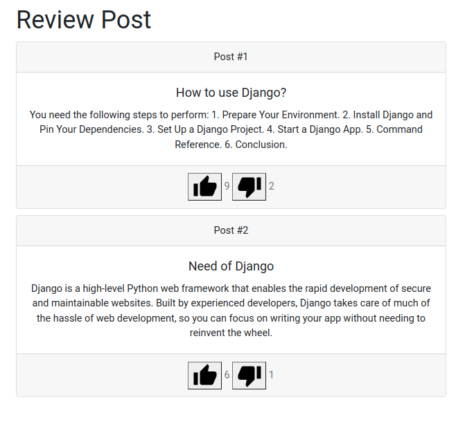

# Post Review in Django

## Installation

1. Clone the repository:

        git clone "https://github.com/lenixbyte/ReviewPostDjango.git"

2. Start the virtual environment:

        cd ReviewPostDjango
        pipenv shell

3. Install requirements:

        pip install -r requirements.txt

4. Run the server:

        python manage.py runserver

## Usage

1. Go to `http://127.0.0.1:8000/admin/` and login with the superuser credentials.

        Username: admin
        Password: admin
    
2. Create a new post by clicking on `Add` button in the `Posts` section.

3. Go to `http://127.0.0.1:8000/` and click on the post like or dislike button to `Like`  or  `Dislike`.

## Screenshots

